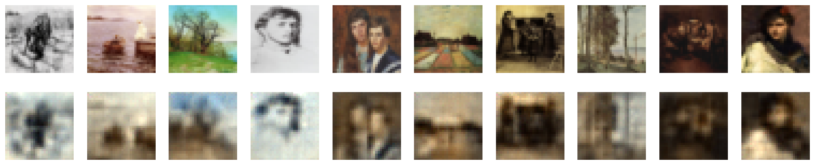
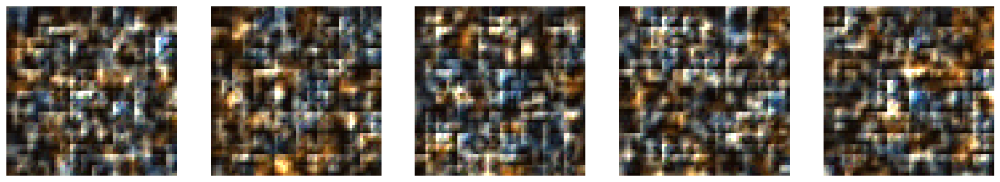

# jax-image-autoencoder

For learning purposes, I implemented an autoencoder using JAX and Flax. 

Reconstructing images from their latent space:

Generating new images from a random vector in the latent space:

